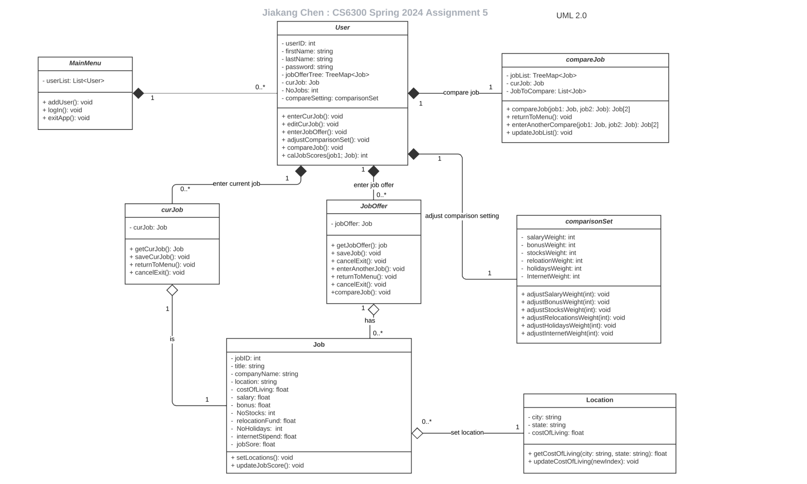
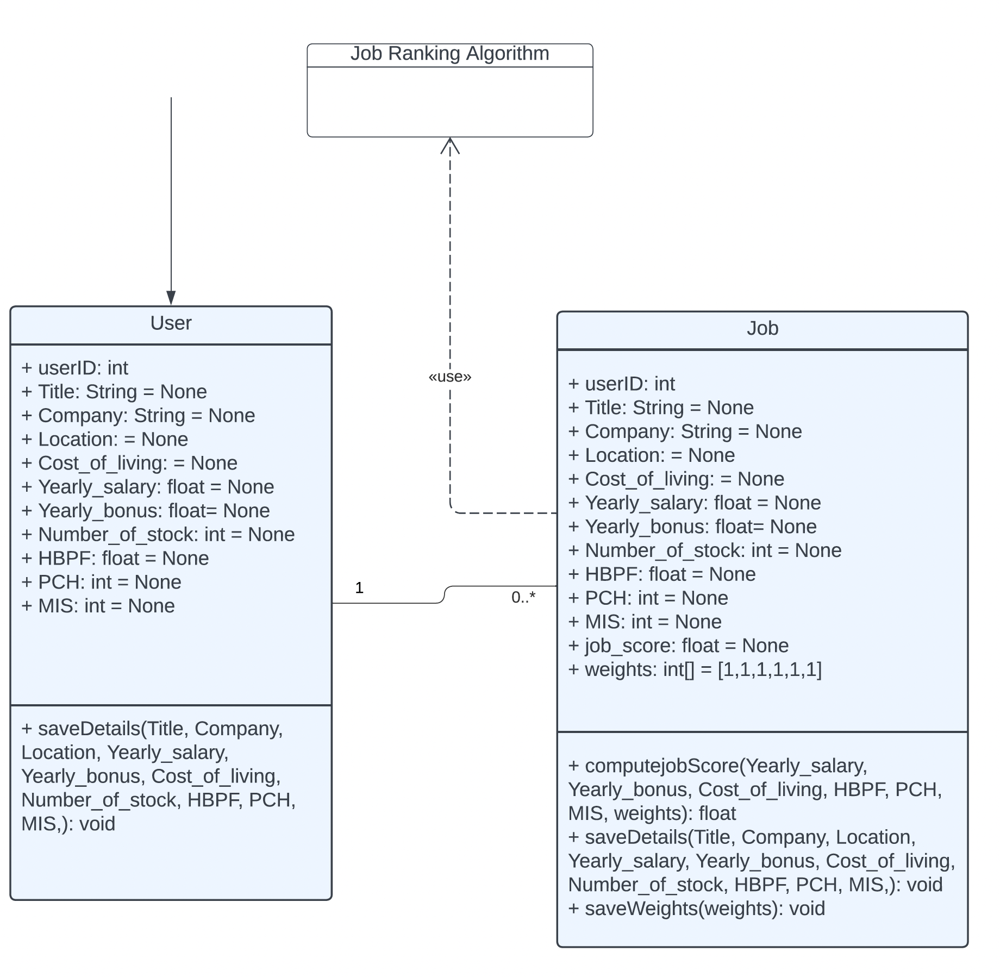

### Design 1

## Pros
- This design successfully meets all the criteria outlined for Assignment 5.
- The `Location` class is effectively designed to retrieve the cost of living information from the database.
- It also facilitates user authentication, allowing them to log in and save their data.

## Cons
- As discussed, we may not need separate classes for current job (`curJob`) and job offers (`jobOffer`). It might be more efficient to merge these into a single `JobOffer` class, which could include both `curJob` and a list of `jobOffer` attributes. This consolidation could be managed within a `JobOfferManager` class, streamlining the architecture and reducing redundancy.
-  We could introduce an additional class, `JobOfferManager`, to serve as an intermediary between `User` and `JobOffer`. This class would be responsible for facilitating the entry and editing of both current job positions and job offers.

### Design 2

### Design 3

## Pros
- The design satifies the requirements for Assignment 5 
- There are only two classes, which reduces overhead and unnecessary complexity 
- The `weights` attribute within the `Job` class provides flexibility in how certain attributes are weighed.

## Cons
- The dependency between the `Job` class and the `Job Ranking Algorithm` is not necessary as any change to the ranking algorithm doesn't affect any attributes within the `Job` class.
- Lacks an attribute within the `User` class to store all the job offers associated with that particular user in a data structure that could easily be retrieved. The attribute `userID` within the `Job` class is the only way to associate that job offer with a particular user. 

### Design 4

### Team Design

### Summary
