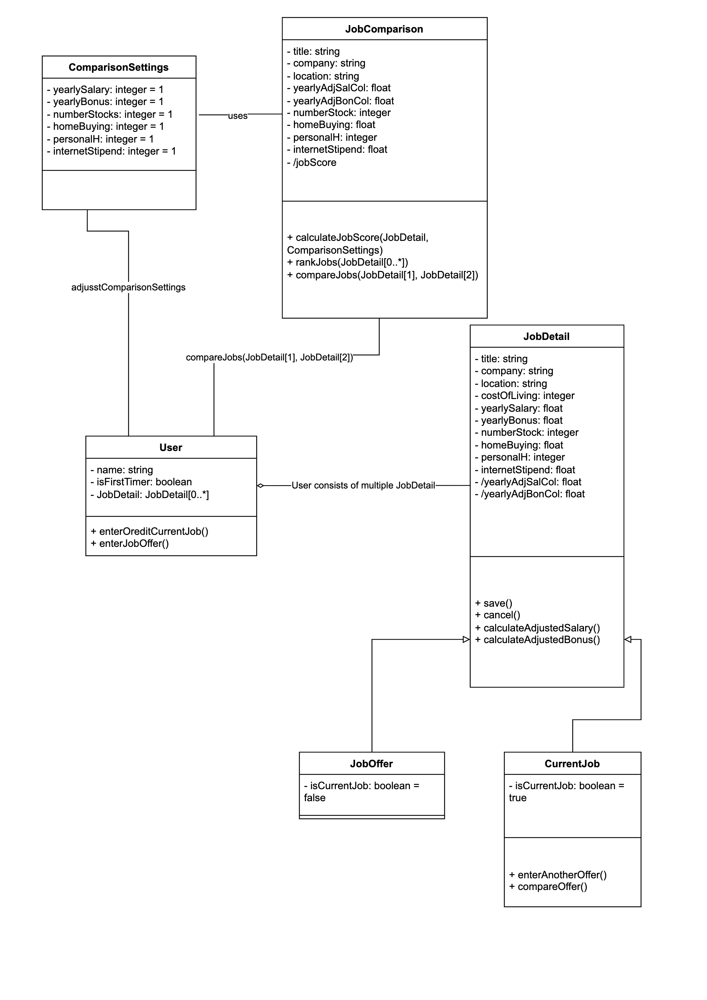
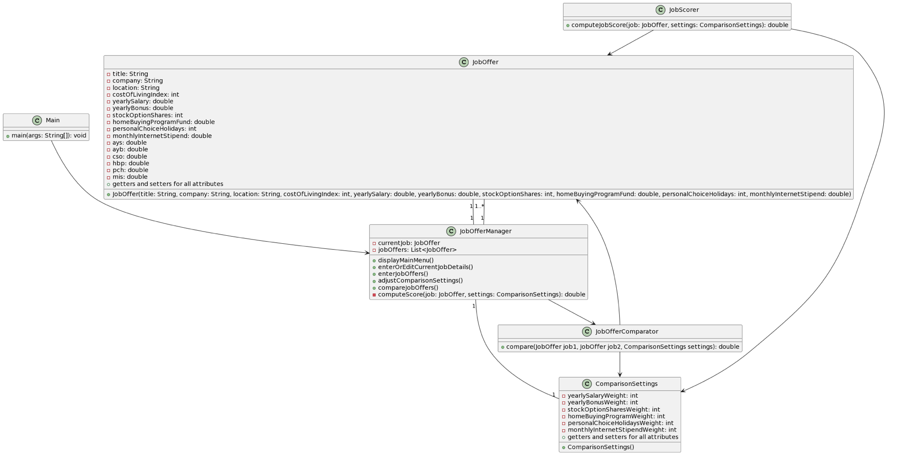
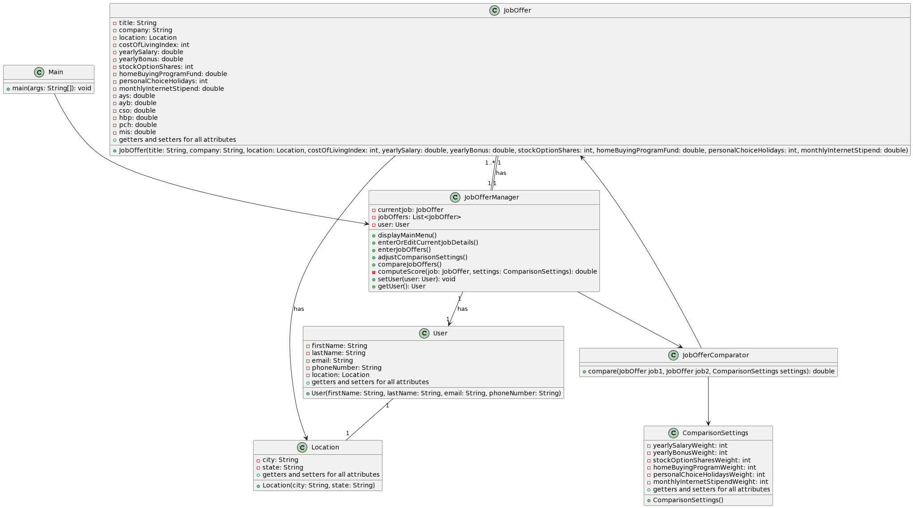

### Design 1

## Pros
- This design successfully meets all the criteria outlined for Assignment 5.
- The `Location` class is effectively designed to retrieve the cost of living information from the database.
- It also facilitates user authentication, allowing them to log in and save their data.

## Cons
- As discussed, we may not need separate classes for current job (`curJob`) and job offers (`jobOffer`). It might be more efficient to merge these into a single `JobOffer` class, which could include both `curJob` and a list of `jobOffer` attributes. This consolidation could be managed within a `JobOfferManager` class, streamlining the architecture and reducing redundancy.
-  We could introduce an additional class, `JobOfferManager`, to serve as an intermediary between `User` and `JobOffer`. This class would be responsible for facilitating the entry and editing of both current job positions and job offers.

### Design 2

## Pros
- This design meets all the criteria outlined for Assignment 5.
- The design has all the necessary classes that interacts with each other to meet the requirements.
- The design is concise and does not unnecessary classes that would have made the UML Class Diagram more complex than it should be.

## Cons
- The association classes JobOffer and CurrentJob could have been a boolean in the JobDetail class instead.
- The 'Location' could have been implemented to effectively retrieve the cost of living information.

### Design 3

## Pros
- The design satifies the requirements for Assignment 5 
- There are only two classes, which reduces overhead and unnecessary complexity 
- The `weights` attribute within the `Job` class provides flexibility in how certain attributes are weighed.

## Cons
- The dependency between the `Job` class and the `Job Ranking Algorithm` is not necessary as any change to the ranking algorithm doesn't affect any attributes within the `Job` class.
- Lacks an attribute within the `User` class to store all the job offers associated with that particular user in a data structure that could easily be retrieved. The attribute `userID` within the `Job` class is the only way to associate that job offer with a particular user. 

### Design 4

## Pros
- The design is thorough and includes in great detail about how the job sorting algorithm will work and how jobs will be sorted
- The design thoroughly satisfies the requirements for assignment 5
- The design uses UML code 

## Cons
- Missing a User and Location class 

### Team Design

Our group UML design combines elements from the individual designs while introducing some unique aspects tailored to meet the requirements collectively. Here are the main commonalities and differences between our group design and the individual ones:

Commonalities:
- JobOffer Class: Like in most individual designs, our group design includes a JobOffer class representing job offers, encompassing attributes such as title, company, location, salary, bonus, etc.
- ComparisonSettings Class: We also have a ComparisonSettings class to manage comparison settings, allowing users to customize weights for different factors affecting job offers.
- JobOfferManager Class: Similar to some individual designs, we have a JobOfferManager class responsible for handling user interactions, entering/editing job details, managing job offers, adjusting comparison settings, and comparing job offers.
- User and Location Classes: Our group design incorporates both User and Location classes, enhancing the user management and providing structured location data.

Differences:
- JobOfferManager/User Relationship: Unlike some individual designs, we directly associate the JobOfferManager with the User class, enabling seamless management of user data and interactions.
- Scoring Algorithm: In contrast to some individual designs, we do not include a separate JobScorer class. Instead, the scoring algorithm logic is encapsulated within the JobOfferManager class, reducing complexity and coupling.
- JobOffer Comparator: While some designs include a dedicated JobOfferComparator class, we incorporate comparison functionality directly within the JobOfferManager, simplifying the design and reducing dependencies.
- Main Class: Our group design retains the Main class as the entry point to the system, serving to orchestrate the application's execution.

Justification:
- Consolidated Design: Our group design aims for simplicity and cohesion by consolidating functionality into fewer classes, reducing redundancy and complexity.
- Enhanced User Management: The inclusion of the User class enables better user data management, allowing for personalized experiences and interactions.
- Streamlined Interaction: By integrating comparison functionality within the JobOfferManager class, we streamline interactions and reduce dependencies, enhancing maintainability and flexibility.

Overall, our group design strikes a balance between individual contributions, incorporating essential features while optimizing for simplicity and effectiveness in meeting the project requirements.

### Summary
Through the process of discussing the designs, several valuable lessons were learned that contributed to our understanding of design principles, teamwork dynamics, and project management. Here's a concise summary of the key takeaways:

Design Principles:
- Simplicity and Cohesion: We learned the importance of striving for simplicity and cohesion in design, avoiding unnecessary complexity and redundancy to enhance maintainability and clarity.
- Flexibility and Modularity: Designing with flexibility and modularity in mind allows for easier adaptation to changing requirements and promotes scalability.
- User-Centric Design: Prioritizing user needs and experiences is paramount in designing effective systems, as reflected in our inclusion of user management features and streamlined interactions.

Teamwork Dynamics:
- Collaborative Decision-Making: Engaging in open discussions and collaborative decision-making processes enabled us to leverage diverse perspectives and arrive at informed design choices.
- Effective Communication: Clear and effective communication among team members facilitated the exchange of ideas, clarification of requirements, and resolution of design challenges.
- Respectful Exchange: Respecting each other's opinions and contributions fostered a positive and productive team environment, promoting creativity and innovation.

Project Management:
- Iterative Refinement: Iterative refinement of designs based on feedback and discussions allowed us to continuously improve and evolve our approach, ensuring alignment with project goals and requirements.
- Timely Decision-Making: Making timely decisions and maintaining momentum in the design process helped us stay on track and meet project milestones effectively.
- Adaptability and Flexibility: Remaining adaptable and flexible in responding to changing requirements and evolving design considerations enabled us to overcome obstacles and deliver a cohesive solution.
In conclusion, the design discussions not only yielded a comprehensive UML representation of our system but also provided valuable insights into design principles, teamwork dynamics, and project management practices, which we can apply to future collaborative endeavors.
