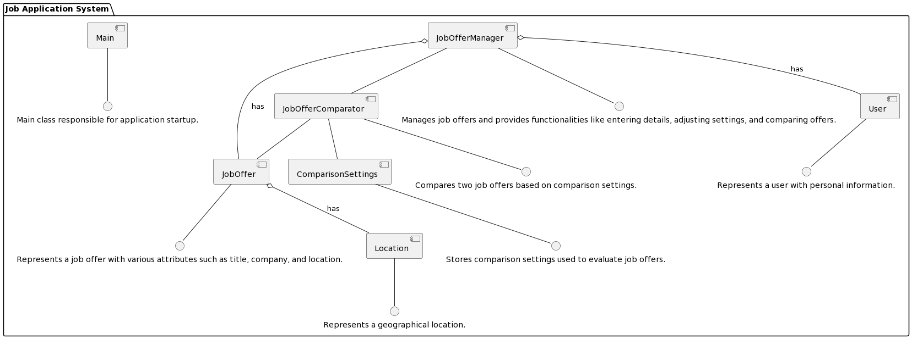
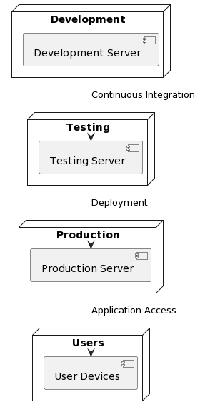

# Design Document

**Author**: Wali Khan

## 1 Design Considerations

### 1.1 Assumptions
- The system assumes that users will input accurate and complete information regarding job offers and comparison settings.
- It assumes stable network connectivity for fetching additional data if needed.
### 1.2 Constraints
- The system must be designed to handle different types of job offers with varying attributes.
- It should consider scalability for potential future enhancements or increased user load.

### 1.3 System Environment
- Hardware: Standard computing devices (PCs, laptops, smartphones) with internet connectivity.
- Software: Compatible with modern web browsers and operating systems (Windows, macOS, Linux, iOS, Android).

## 2 Architectural Design

### 2.1 Component Diagram

- JobOffer: Represents a job offer entity with various attributes such as title, company, location, etc.
- ComparisonSettings: Stores comparison settings used to evaluate job offers based on different criteria.
- JobOfferComparator: Compares two job offers based on specified comparison settings to determine which offer is more favorable.
- JobOfferManager: Manages job offers within the system, providing functionalities like entering details, adjusting settings, and comparing offers.
- Main: Main class responsible for initiating the application and controlling the overall flow.
- User: Represents a user entity with personal information such as name, email, and phone number.
- Location: Represents a geographical location associated with a job offer.

### 2.2 Deployment Diagram

The deployment process outlined in the diagram is straightforward and intuitive:

- Continuous Integration (CI): The application undergoes continuous integration on the development server, where changes made by developers are integrated and tested.
- Testing: After successful integration, the application is deployed to the testing server for further testing and quality assurance processes.
- Production Deployment: Once the application passes testing, it is deployed to the production server, making it accessible to users.
- User Access: Users can then access the deployed application on their devices, such as PCs, laptops, or smartphones, for utilization.

## 3 Low-Level Design

### 3.1 Class Diagram

## 4 User Interface Design

