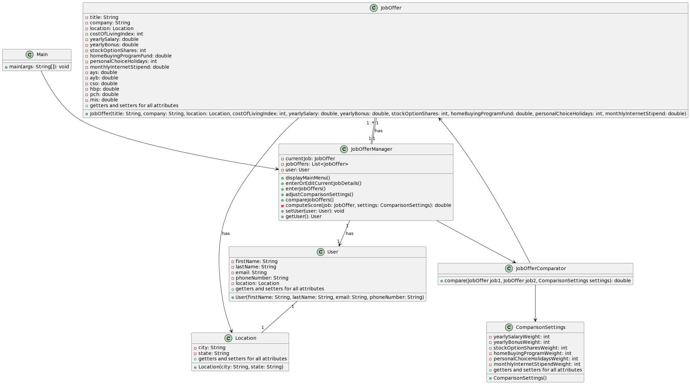
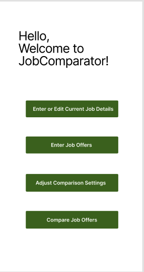
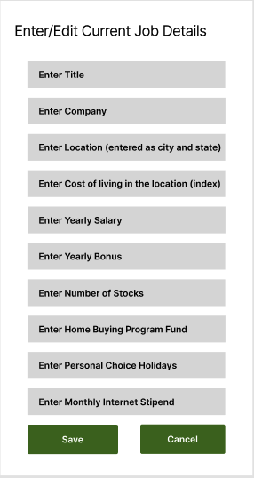
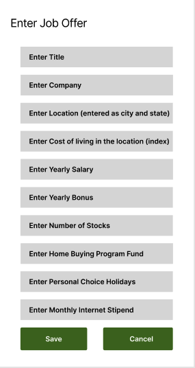
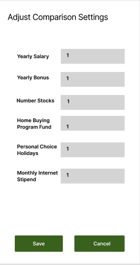
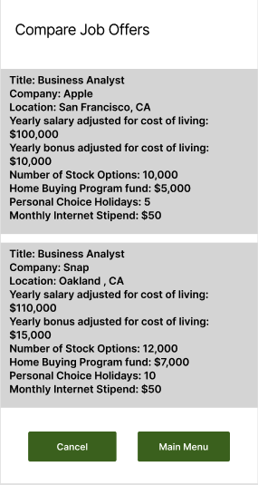

# Design Document

**Author**: Wali Khan

## 1 Design Considerations

### 1.1 Assumptions
- The system assumes that users will input accurate and complete information regarding job offers and comparison settings.
- It assumes stable network connectivity for fetching additional data if needed.
### 1.2 Constraints
- The system must be designed to handle different types of job offers with varying attributes.
- It should consider scalability for potential future enhancements or increased user load.

### 1.3 System Environment
- Hardware: Standard computing devices (PCs, laptops, smartphones) with internet connectivity.
- Software: Compatible with modern web browsers and operating systems (Windows, macOS, Linux, iOS, Android).

## 2 Architectural Design

### 2.1 Component Diagram

*This section should provide and describe a diagram that shows the various components and how they are connected. This diagram shows the logical/functional components of the system, where each component represents a cluster of related functionality. In the case of simple systems, where there is a single component, this diagram may be unnecessary; in these cases, simply state so and concisely state why.*

### 2.2 Deployment Diagram

*This section should describe how the different components will be deployed on actual hardware devices. Similar to the previous subsection, this diagram may be unnecessary for simple systems; in these cases, simply state so and concisely state why.*

## 3 Low-Level Design

### 3.1 Class Diagram

## 4 User Interface Design

