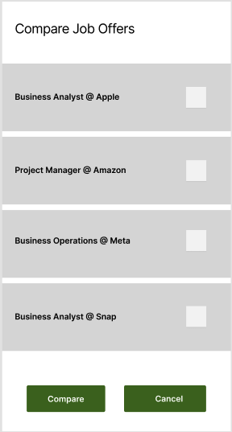

# Design Document

**Author**: Wali Khan

## 1 Design Considerations

### 1.1 Assumptions
- The system assumes that users will input accurate and complete information regarding job offers and comparison settings.
- It assumes stable network connectivity for fetching additional data if needed.
### 1.2 Constraints
- The system must be designed to handle different types of job offers with varying attributes.
- It should consider scalability for potential future enhancements or increased user load.

### 1.3 System Environment
- Hardware: Standard computing devices (PCs, laptops, smartphones) with internet connectivity.
- Software: Compatible with modern web browsers and operating systems (Windows, macOS, Linux, iOS, Android).

## 2 Architectural Design

### 2.1 Component Diagram

- Component Diagram is the same as our UML diagram. Please refer to Section 3.1 
### 2.2 Deployment Diagram

## 3 Low-Level Design

### 3.1 Class Diagram

## 4 User Interface Design

