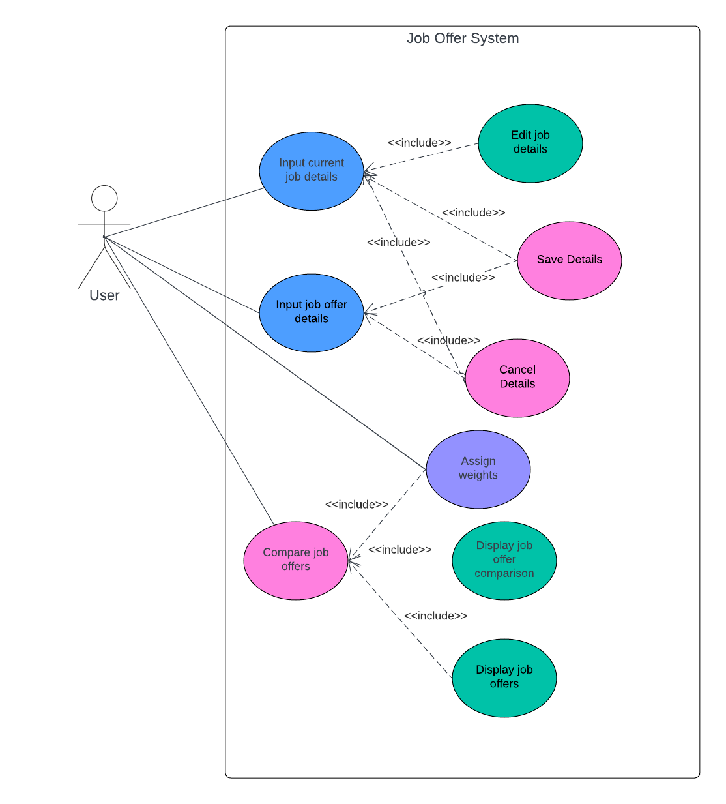

# Use Case Model

**Author**: Team139

## 1 Use Case Diagram

## 2 Use Case Descriptions

	1. Input current job details
		Requirements: Allows the user to input their current job details
		Pre-conditions: User must be on the main menu to access their current job details
		Post-conditions: Either the user has saved their current job details or decides to cancel. If cancelled, return to main menu.
		Scenarios: 
		1. User starts the application and is presented with a main menu.
		2. User clicks on a button that pertains to the job details section and is transitioned to that screen.
		3. User types in their job details in each input box. There is a total of 10 input boxes.
		4. 
			Case 1: User saves the job details by clicking the 'save' button and is returned to the main menu.
			Case 2: User cancels submitting job details by clicking the 'cancel' button and is returned to the main menu.

	2. Input job offer details
		Requirements: Allows the user to input their job offer details 
		Pre-conditions: User must be on the main menu to access and enter their job offer details
		Post-conditions: Either the user has saved their job offer details or decides to cancel. If cancelled, return to main menu.
		Scenarios:
		1. User starts the application and is presented with a main menu.
		2. User clicks on a button that pertains to the job offer details section and is transitioned to that screen.
		3. User types in their job offer details in each input box. There is a total of 10 input boxes.
		4. 	
			Case 1: User saves the job details by clicking the 'save' button.
			Case 2: User cancels submitting job details by clicking the 'cancel' button.
		5. 
			Case 1: User decides to enter another offer.
			Case 2: User decides to return to the main menu.
			Case 3: Compare the offer with their current job details.

	3. Compare job offers
		Requirements: Allows the user to select a job offer to compare either with their current job or another job offer
		Pre-conditions: User must be on the main menu and there needs to be at least one job offer currently saved
		Post-conditions: User is presented with a table comparing two jobs and can perform another comparison
		Scenarios:
		1. User starts the application and is presented with a main menu.
		2. User clicks on a button that pertains to the job comparison section and is transitioned to that screen.
		3. User will be presented with a list of job offers to choose from that is ranked.
		4. User selects two jobs to perform a comparison on and clicks the 'comparison' button.
		5. Presented with a table comparing the two jobs.
		6. 
			Case 1: User can decide to perform another comparison by selecting a different job or jobs.
			Case 2: User can decide to return back to the main menu.

	4. Assign weights
		Requirements: Allows the user to alternate and assign weights to certain job detail attributes
		Pre-conditions: User must be on the main menu 
		Post-conditions: Either weights have been assigned or there has been no change to any weighting
		Scenarios:
		1. User starts the application and is presented with a main menu.
		2. User clicks on a button that pertains to the 'adjusting the comparison settings' section and is transitioned to that screen.
		3. User evaluates and assigns weights to certain job detail parameters

	5. Edit job details
		Requirements: Allows the user to alternate some of their current job details 
		Pre-conditions: User must be on the main menu and there needs to be an existing current job detail saved to edit
		Post-conditions: Either the user has saved their new current job details or decides to cancel. If cancelled, return to main menu.
		Scenarios:
		1. User starts the application and is presented with a main menu.
		2. User clicks on a button that pertains to the job details section and is transitioned to that screen.
		3. User types in their job details that they want to change from their current job in each input box. There is a total of 10 input boxes.
		4. 
			Case 1: User saves the job details by clicking the 'save' button and is returned to the main menu.
			Case 2: User cancels submitting job details by clicking the 'cancel' button and is returned to the main menu.

	6. Display job offer comparison
		Requirements: Allows the user to see a table comparing two jobs
		Pre-conditions: Must be in the "compare job offers" section and has selected two jobs to compare
		Post-conditions: A table will be displayed that shows and compares the two jobs with certain details
		Scenarios:
		1. User starts the application and is presented with a main menu.
		2. User clicks on a button that pertains to the job comparison section and is transitioned to that screen.
		3. User will be presented with a list of job offers to choose from that is ranked.
		4. User selects two jobs to perform a comparison on and clicks the 'comparison' button.
		5. Presented with a table comparing the two jobs.

	7. Display job offers 
		Requirements: Allows the user to see a table of job offers
		Pre-conditions: Must be in the "compare job offers" section 
		Post-conditions: A table will be displayed that shows a list of job offers
		Scenarios:
		1. User starts the application and is presented with a main menu.
		2. User clicks on a button that pertains to the job comparison section and is transitioned to that screen.
		3. User will be presented with a list of job offers to choose from that is ranked.

